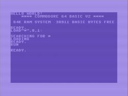
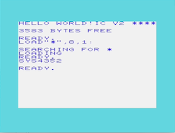
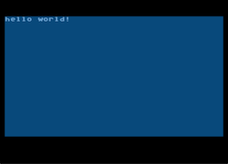
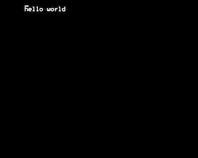
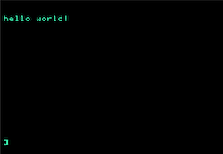

# hello-6502-world

`Hello World!` for various 6502/10 based machines.

Aim is to have a working toolchain that can do all the machine specific
stuff to get it running on an emulator and real hardware.

Commodore 64:

VIC 20:

Atari 8-bit:

BBC Micro:

Apple II:

# Usage

## Dependencies

Install depenencies with `install_tools.sh` 

## Emulators

`hello-6502-world` has been tested on OSX 10.14.6 with:

* VIC / C64 - [VICE](http://vice-emu.sourceforge.net/index.html#download) - Export `VICE_HOME` to point to your VICE install dir
* Atari 8 Bit - [Atari 800 mac X](https://www.atarimac.com/atari800macx.php)
* BBC [BeebEm](http://www.mkw.me.uk/beebem/)
* Apple II[Virtual II](http://www.virtualii.com/)

## Build and run

`make` with:

* `C64` - `make EMU=x64 PLATFORM=C64`.
* `VIC 20` - `make EMU=xvic PLATFORM=VIC20` then type `SYS 4352` in the emulator.
* `Atari 8-bit` - `make PLATFORM=ATARI EMU=open PACKAGE=xex`
* `BBC Micro` - `make PLATFORM=BEEB EMU=open PACKAGE=ssd`
* `Apple II` - `make PLATFORM=APPLEII EMU=open PACKAGE=dsk`

You'll need to `make clean` when switching platforms.
